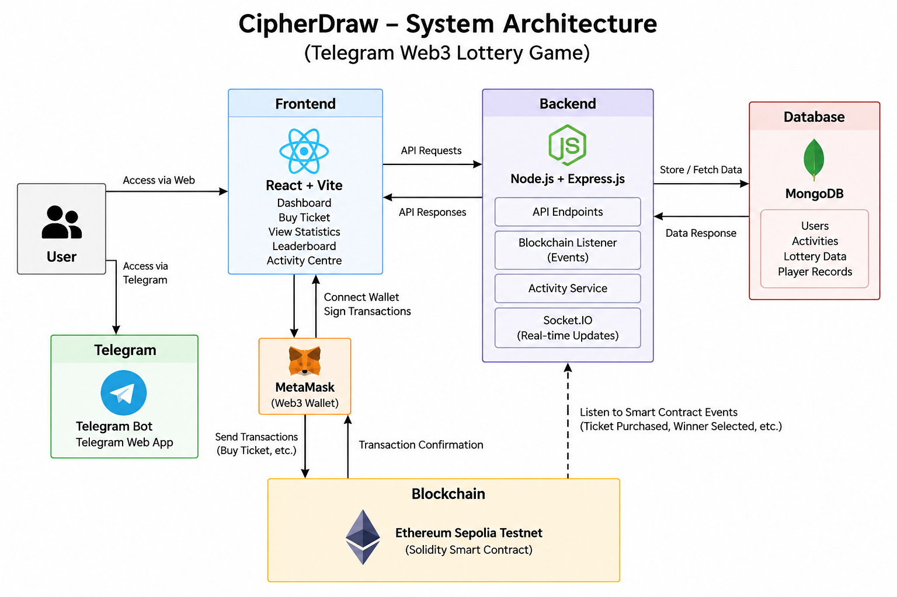

CipherDraw – Telegram Web3 Lottery Game

CipherDraw is a Telegram-integrated Web3 lottery game that combines blockchain technology, smart contracts, wallet integration, and a web-based lottery interface.

The application allows users to connect their MetaMask wallet, participate in lottery rounds using Ethereum Sepolia ETH, purchase lottery tickets, view lottery statistics, check the leaderboard, and track recent blockchain activity.


Live Demo

Vercel Frontend:  
https://telegram-web3-lottery-game.vercel.app/

 Deployment Note:  
> The frontend is deployed on Vercel. The backend deployment on Railway is currently unavailable because the Railway trial has expired. Therefore, some backend-dependent features, such as activity synchronization, may not function correctly in the hosted version.

> The complete application was successfully tested and demonstrated in the local development environment with the backend, MongoDB, Telegram integration, and Ethereum Sepolia smart contract.


 GitHub Repository

https://github.com/tanishkamadke-alt/telegram-web3-lottery-game


 System Architecture

The CipherDraw system consists of a frontend, backend, database, blockchain smart contract, and Telegram integration.



 Architecture Flow

User → React/Vite Frontend → Express Backend → MongoDB

At the same time:

User → MetaMask → Ethereum Sepolia Smart Contract

The backend listens to blockchain events and processes lottery activity for storage and real-time updates.


 Key Features

- 🔐 MetaMask wallet integration
- 🎟️ Web3 lottery ticket purchase
- ⛓️ Ethereum Sepolia smart contract integration
- 🏆 Manager-controlled winner selection
- 💰 Prize pool management
- 📊 Lottery statistics dashboard
- 🏅 Player leaderboard
- 📜 Recent activity tracking
- 🤖 Telegram Web3 integration
- 🔄 Blockchain event monitoring
- 🗄️ MongoDB-based activity storage
- ⚡ Real-time updates using Socket.IO
- 👨‍💼 Manager controls for lottery rounds


 Technology Stack

| Category | Technologies |

| Frontend | React.js, Vite, Ethers.js, HTML, CSS |
| Backend | Node.js, Express.js, Socket.IO |
| Database | MongoDB |
| Blockchain | Solidity, Ethereum Sepolia, Hardhat, OpenZeppelin |
| Wallet | MetaMask |
| Telegram | Telegram Bot API, Telegram Web App |
| Deployment | Vercel, Railway |


 How the Application Works

1. The user opens CipherDraw through the web  application or Telegram Web App.
2. The user connects their MetaMask wallet to the Ethereum Sepolia network.
3. The manager starts a lottery round.
4. Users purchase lottery tickets using Sepolia ETH.
5. Ticket purchases are recorded by the Solidity smart contract.
6. The backend blockchain listener monitors relevant smart contract events.
7. Activity information is stored in MongoDB.
8. Socket.IO provides real-time activity updates to the application.
9. After the lottery duration ends, the manager can draw the winner.
10. The smart contract transfers the prize pool to the selected winner.
11. Lottery history and winner information are recorded.
12. Dashboard statistics, leaderboard information, and recent activity are updated.


 Smart Contract

The Lottery smart contract manages the core lottery functionality, including:

- Lottery rounds
- Lottery duration
- Ticket purchases
- Player records
- Prize pool
- Winner selection
- Prize transfer
- Lottery history
- Manager-only operations

 Network

Ethereum Sepolia Testnet

 Contract Address

```text
0xd93dbb2e66e720389e5a7838dC049e8a8E57517F